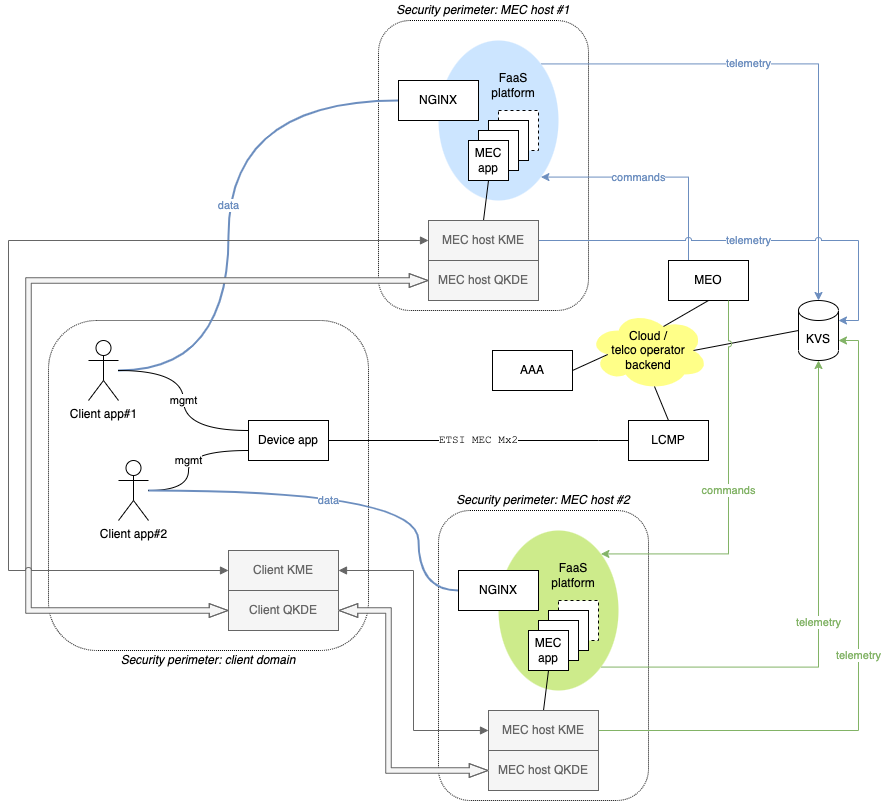
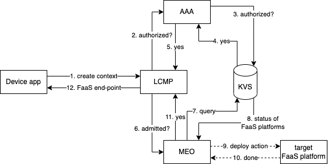
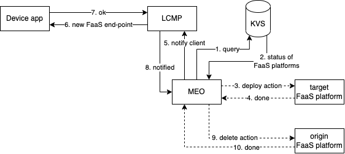
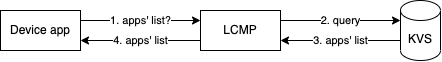

# ETSI MEC-QKD architecture with two MEC hosts

Example architecture with two ETSI MEC hosts offering MEC apps as serverless functions.

Each ETSI MEC host is also within its own security perimeter, also including the KME and QKDE, using ETSI QKD terminology.
Likewise, the client apps, the ETSI MEC device app, and the client KME/QDKE are also within a security perimeter.

The LCMP, MEO, KVS, and AAA logical components are assumed to be in the cloud or in the telco operator backend: they are not traversed by data paths between the client apps and the MEC apps and, hence, they do not need to be in a security perimeter.

## Component roles

- **Client app**:
  - it uses computation offloading services from an edge system through the invocation of serverless computing functions, which are stateless;
  - access to the services requires an initialization phase and it is subject to authentication and authorization;
  - the client app does not know the end-point of the FaaS platform at start up: this piece of information is acquired as part of the initialization phase from the MEC system, mediated by the device app.
- **Device app**:
  - it is the interface between the client apps and the LCMP;
  - the device app knows the end-point of the LCMP, e.g., by means of static configuration or DNS resolution of a special name.
- **FaaS platform**: it supports the following minimal set of operations:
  - deploy new actions: this is done by the MEO upon the assignment of a client app for a given MEC app that was not already present in the FaaS platforms;
  - delete existing actions: this can be done by the MEO when unassigning the last client app using a given MEC app in the FaaS platform;
  - the FaaS platforms injects continuously telemetry data into a KVS, to be used by the MEO to infer the utilization and manage resources across multiple MEC hosts accordingly; 
- **MEO**: it is responsible for assigning client apps to FaaS platforms based on the current state available on the KVS:
  - 1) upon the creation of a context; and
  - 2) as part of periodic optimization of the resources.
- **LCMP**: it is the interface of the client apps towards the MEC system for:
  - listing the MEC apps supported by the MEC system;
  - creating a new client app context;
  - deleting a client app context;
  - notifying the client app of service migration towards the FaaS platform in a different MEC host.
- **AAA**:
  - it verifies that the context creation operation authorized and authenticated. 
- **KVS**: it keeps the run-time configuration of the MEC system:
  - list of the MEC apps supported by the MEC system;
  - active contexts;
  - telemetry data from the QKD sub-system and the FaaS platforms, to be used by the MEO to assign client apps to MEC hosts.

## Sequence diagrams

In this section we illustrate some sequence diagrams of common operations.

### Create context

The context creation procedure is triggered by a device app during the initialization phase of the client app. If successful, the procedures allows a device app to set up the MEC resources to provide the client app with the service requested. The end-point that the client app should be to reach the target FaaS platform identified by the MEO is returned by the LCMP to the device app in the last step.

The _deploy action_ operation is optional, because the action might be already available on the FaaS platform because it is used by another client app with an active context.

### Migrate context

The context migration procedure is triggered by the MEO upon optimization of the resources in use. In the sequence diagram below we assume that the MEO periodically queries the KVS to obtain telemetry data about the utilization of the FaaS platforms in the MEC hosts. Based on an internal optimization process, it may decide to migrate a set of client apps from a FaaS platform to another. When this happens, for each client app, the corresponding device app must be notified of the new end-point to be used.

The _deploy action_ operation is optional, because the action might be already available on the target FaaS platform because it is used by another client app with an active context.

Likewise, the _delete action_ operation is optional, because the action might be used by another client app with an active context in the origin FaaS platform.

### List apps

The list apps procedure is triggered by a device app during the initialization phase of the client app. It allows the device app to retrieve information about the MEC apps that are supported by the MEC system, together with additional information that might be useful to the clients, such as the versions available. In the sequence diagram below we assume that the up-to-date information on the MEC apps is stored in the KVS.

## Acronyms

| Acronym | Explanation                      |
| ------- | -------------------------------- |
| AAA     | Authentication and Authorization |
| FaaS    | Function-as-a-Service            |
| KME     | Key Management Entity            |
| KVS     | Key-Value Store                  |
| LCMP    | Life Cycle Management Proxy      |
| MEC     | Multi-Access Edge Computing      |
| MEO     | MEC Orchestrator                 |
| QKD     | Quantum Key Distribution         |
| QKDE    | QKD Entity                       |